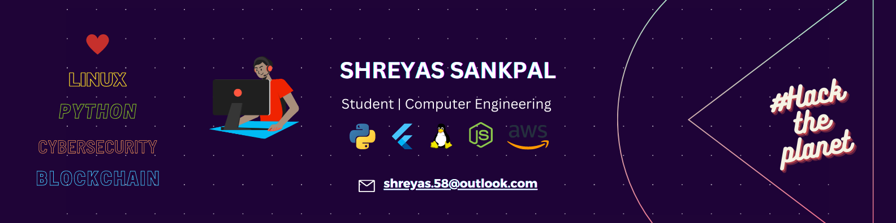

  
  

<h3 align="center">
  Hey there! I'm Shreyas
  
</h3>

### :man_technologist: About Me :

I am a Computer Engineering Student and CyberSec enthusiast from India!

- :telescope: I’m working on **Machine Learning Project** with application in **Cybersecurity**.

- :seedling: Exploring mobile app development with **Flutter**.

[comment]: <> (- :dancers: I am looking for collaboration in **Blockchain and Cybersecurity Projects**.)

- :speech_balloon: Ask me about **Linux**, **Blockchain**, **Penetration Testing** and **Ethical Hacking**.

- :mailbox:How to reach me:  

---

### :hammer_and_wrench: Languages and Tools :

#### Languages

  &nbsp;
  &nbsp;
  &nbsp;
  &nbsp;
  &nbsp;
  &nbsp;
  &nbsp;
  &nbsp;
  &nbsp;
  &nbsp;

#### Frameworks

  &nbsp;
  &nbsp;
  &nbsp;
  &nbsp;
  &nbsp;
  &nbsp;
  &nbsp;
  &nbsp;

#### Cloud Platforms

  &nbsp;
  &nbsp;

#### Servers

  &nbsp;
  &nbsp;

#### Databases

  &nbsp;
  &nbsp;
  &nbsp;
  &nbsp;

#### Other tools

&nbsp;

&nbsp;

---

### :star: My Stats

